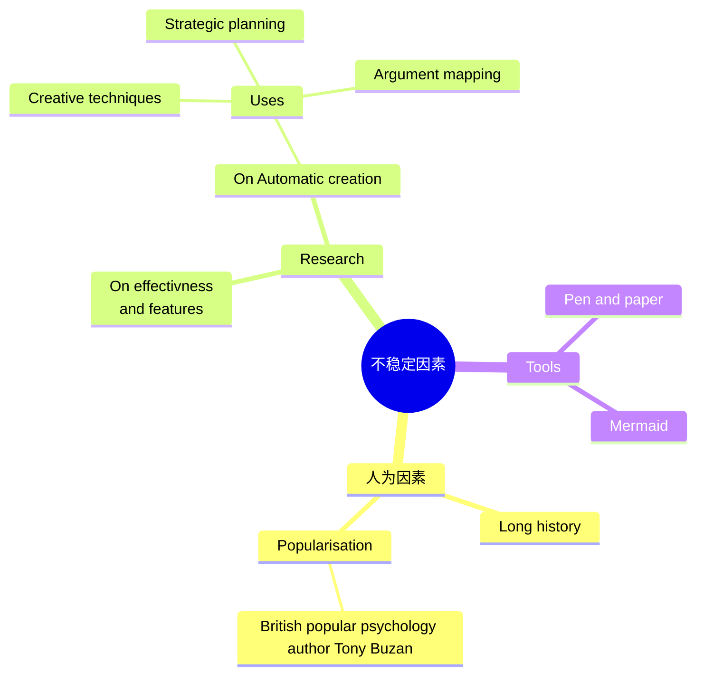

## 背景

稳定性的重要性，在VUCA约束下，达到稳定性，是对工程师全方位能力的锻炼。

### VUCA

## 不稳定的原因

```mermaid
mindmap
  root((不稳定因素))
    人为因素
      Long history
      ::icon(fa fa-book)
      Popularisation
        British popular psychology author Tony Buzan
    Research
      On effectivness<br/>and features
      On Automatic creation
        Uses
            Creative techniques
            Strategic planning
            Argument mapping
    Tools
      Pen and paper
      Mermaid
```

--- 
1. https://www.cnblogs.com/lowmanisbusy/p/12733695.html

