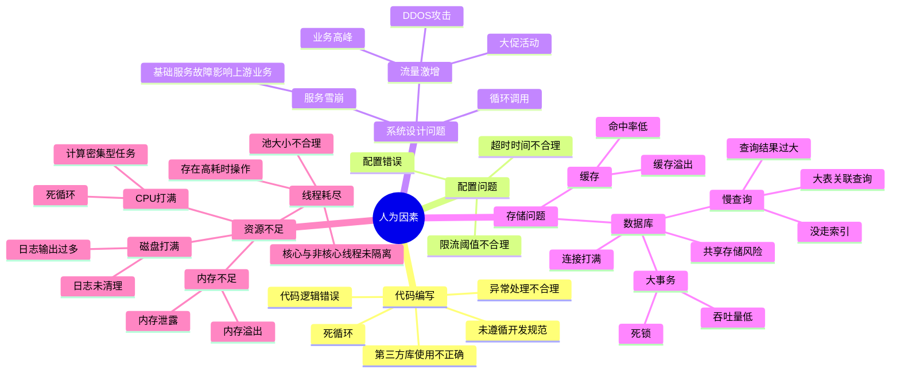
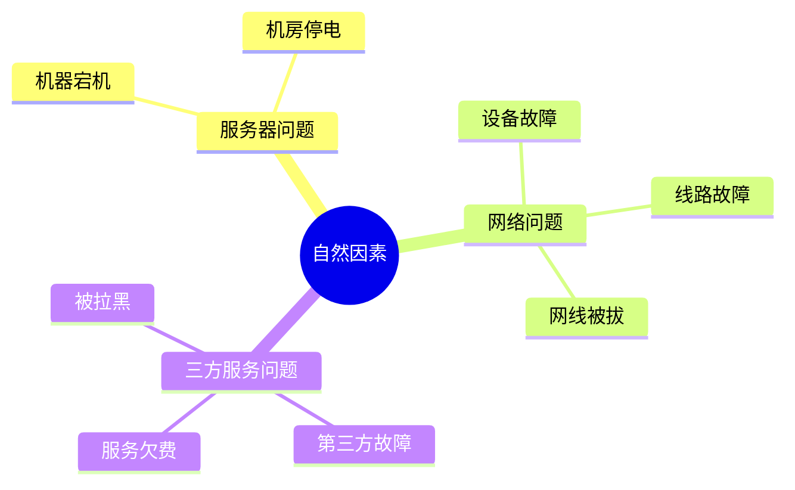

## 背景

稳定性的重要性，在VUCA约束下，达到稳定性，是对工程师全方位能力的锻炼。

### VUCA
V: Volatility 易变性 
U: Uncertainty 不确定性
C: Complexity 复杂性
A: Ambiguity 模糊性

### CAP理论
C：Cost 成本
A：Quality 质量
P: Productivity 效率

## 不稳定的原因

### 人为因素

    人为因素应通过规范流程来减少失误概率，提前预防，尽早发现，将功夫放在平日。

### 自然因素

自然因素虽受客观因素影响，可控性不高，但是付费通道服务的费用问题，却是需要进行常规监控的。

## 稳定性总结

做稳定性建设一定要结合公司或组织的实际情况，量入为出，最合适的方案才是最好的方案。稳定性建设的房子，如下：

## 事前建设四要素
稳定性建设四要素：人、工具、预案和目标。

### 第一要素： 人

要解决几个问题：
- 稳定性建设涉及哪些部门
- 如何降低犯错的概率
- 如何提高稳定性意识
- 如何定责
- 如何激励

稳定性建设工作需要老板支持，它的实施一般需要开发、测试、运维、安全还有产品等同学参与，而且主导方应该是开发、测试和运维。确定了参与方后，就可以做关键的一步：“参与稳定性建设的每个团队都需要在OKR中背负一部分稳定性指标”，这也是为什么说稳定性建设工作需要老板支持，因为和绩效考核相关。

*稳定性工作，规范先行*。OKR的部分只是让各参与方在稳定性方面工作的投入变成合规化，平时如何去参与稳定性建设还得“有迹可循”，对于开发和测试来说就是要根据公司的当前技术体系去建设开发规范、提测规范、测试规范、上线规范、复盘规范等。我们拿和软件开发最相关的开发规范来说，开发规范是对开发人员的要求，让开发人员知道什么是必须要做的、什么是推荐的、什么是应该避免的。通常开发规范至少应该包括如下几个部分：

*编码规范*：对外接口命名方式、统一异常父类、业务异常码规范、对外提供服务不可用是抛异常还是返回错误码、统一第三方库的版本、哪些场景必须使用内部公共库、埋点日志怎么打、提供统一的日志、监控切面实现等，编码规范除了能规范开发的编码行为、避免犯一些低级错误和踩一些重复的坑外，另一个好处是让新入职的同学能快速了解公司的编码原则，这点对编码快速上手很重要。这里再重点说一下为什么要统一异常父类和业务异常码，例如虽然不同模块（这里的模块指的是能独立部署的项目）可能有不同的异常父类，比如订单模块的异常父类是OrderException、交易支付模块的异常父类是TradeException，而OrderException和TradeException的父类是BizException（当然BizException是定义在一个通用共公共库中的），而我们也需要去统一异常码，比如200代表正确的返回码，异常的返回码是6位数字（前3位代表模块，后3位代表异常类型），有了统一的异常父类和异常码后，很多切面就都可以由公共库来做了，比如统一的监控、统一的出入口日志打印，统一的异常拦截，压测标识透传、特殊的字段埋点等，千万别小看这些，这些能在未来持续提升研发效率，降低稳定性工作成本。

*公共库使用规范*：为了能对通用功能进行定制化改造和封装，公司内部肯定会有一些公共库，例如日志库、HTTP库、线程池库、监控埋点库等，这些库都“久经考验”，已经被证实是有效且可靠的，这些就应该强制使用，当然为了适应业务的发展，这些公共库也应该进行迭代和升级。

*项目结构规范*：为了贯彻标准的项目结构，一方面我们需要为各种类型项目通过“项目脚手架”来创建标准的项目结构原型，然后基于这个项目原型来进行开发，统一的项目结构一个最显著的好处是让开发能快速接手和了解项目，这种对于团队内维护多个项目很重要，人员能进行快速补位。

*数据库规范*：数据库连接资源堪比CPU资源，现在的应用都离不开数据库，而且通常数据库都属于核心资源，一旦数据库不可用，应用都没有太有效的止损手段，所以在数据库规范里，库名、表名、索引、字段、分库分表的一些规范都必须明确，

*考试*，将这些规范和历史的线上事故整理成试题，让新老开发定期去考试，考试是一种传统的考核机制，我们可以把规范和公共库的更新部分，也及时加入到考试试题中，来督促大伙及时学习。

有了OKR、规范和考核机制，加上我们定期宣导，相信各成员的稳定性意识会有显著提高。

事故定责一般是比较复杂的过程，除非事故原因非常简单明了，但实际上事故原因常常涉及多个团队，如果责任分摊不合理，难免会引发跨团队的争吵，合理的做法是引入第三方稳定性团队来干预，例如滴滴的星辰花团队，星辰花会撰写定责指南，并制定一些相关流程机制。

当然，如果达成稳定性年度目标，也应该对这些团队进行适当表彰。

### 第二要素： 工具

建设必要的工具，来支撑稳定性目标的实现。常见的工具和平台包括：日志采集分析检索平台（例如ELK）、监控告警平台（例如Grafana）、分布式追踪系统（例如APM）、自动化打包部署平台（例如KooK）、服务降级系统、预案平台、根因定位平台、放火平台等。

工具本质上是手段，它能降低我们在稳定性工作上投入的成本，例如有了监控告警平台，我们就不需要专人时刻盯着日志或大盘，有了分布式追踪系统，问题定位会更有效率，有了降级系统，一些故障能自动控制和恢复，不用我们再上线一次。要想做好稳定性工作，工具必不可少，没有工具，稳定性建设总是低效的。

### 第三要素： 预案

完善的紧急预案能回答如下4个问题：

- 故障发生时我们该做什么？
- 谁来指挥？
- 谁来决策？
- 如何善后？

当一个不那么容易定位的故障发生时，你应该做的第一件事应该是什么？这在不同公司、同一个公司同一个团队的不同成员恐怕都会给出一个不同的答案，而在滴滴内部，我们大多会第一时间通知团队内其他成员、Leader（寻求帮助）和客服、上游业务开发等可能的影响方 （问题周知）。当这一步做完以后，一般就会有一部分同学加入问题排查和止损，然而介入的人多了，排查和止损的效率不一定会成比例的提升，这时候协调者很重要，协调者要避免介入的同学在做重复工作，协调者还需要持续和客服、上游业务开发等影响方沟通（我们曾经就经历过由于问题排查问题进度没有及时有效和业务方沟通，业务方将故障升级的case）。对于排查问题和止损的同学来说，要操作某个开关，有可能还要去查代码看开关的名字是什么，还有可能关掉一个功能需要操作多个开关，这些在紧急时刻都有可能由于慌乱而出错。而且什么条件下才能操作开关，谁能决定应不应该操作开关，恐怕在当时很难去做最正确的事情，而这一切，没错，都应该提前写到预案中！！！

紧急预案一般要包含如下内容：

- 故障发生时应该通知哪些人或团队。
- 如何选出协调者，什么情况下该选出协调者。
- 协调者的职责有哪些。
- 需要操作开关时，谁有权利决策。
- 常见故障以及对应的止损方式。
- 止损的原则是什么，什么是最重要的。
- 善后方案谁来拍板。

预案很重要，完备的预案能降低故障定位和止损的时间，提升协作效率。

### 第四要素： 目标

稳定性目标是要平衡建设投入成本和业务产出的关系。可以将故障等级分成了P0至P5六个等级，P0、P1、P2属于重大事故，是需要消耗服务不可用时长的（根据全年定的服务可用时长占比指标来计算出某个部门的全年服务不可用总时长），一旦年底某个部门的全年服务不可用时长超过年初设定的阈值，就会有一定的处罚，并影响部门绩效（之前达标也有奖励，但后来奖励取消了）。

## 稳定性建设四个方向

### 第一个方向：根基要抓牢（45%）

稳定性建设工作重在预防，根据作者多年的工作经验，至少6成线上故障都可以在预防工作中消除，我们需要投入45%的精力来做根基建设，所谓根基建设，就是把开发、测试、上线这三大流程做透！！下面列了几个关键点：

*Code Review*：CR其实是一个很重要的环节，当一个开发整个编码和提测都可以自己闭环搞定时，时间一长就容易产生懈怠，这时候写隐患代码的几率会大大提高，CR的过程并不是diss的过程，这个一定要在团队内拉齐，相反，CR是一次很好的团队沟通和塑造自己影响力的机会。我就很佩服那些代码写得质量高并且能把整个流程讲顺的人。我们团队的项目都接入了全流程（例如滴滴的鲲鹏），分支合master必须要其他人Review，但这是“离线”的，没有代码作者讲的过程，效果没有几个人坐在小黑屋讲的好，只是更快而已。我们团队规定，大于等于4人日的项目需要进行小黑屋CR。CR还可以让其他成员来检测该代码实现是否遵循了开发规范，毕竟“先污染后治理”的成本太高，记住，CR一定是一个相互学习的过程。

*设计评审*：再也没有比糟糕的设计更有破坏力的东西了，设计评审和CR可以放在一起做，先评审设计再进行CR，有人就会说，都编码完了才进行设计评审是不是晚了？其实这要看情况而定，如果团队内部经常产出“糟糕设计”，那么我觉得设计评审就应该编码之前来做，但如果团队成员专业能力和经验都还不错，那么我们允许你再编码之后再做设计评审，而且编码的过程其实也是设计的过程，可以规避提前设计而导致后续编码和设计不一致的问题。设计评审的原则是，既要讲最终的设计方案，也要讲你淘汰的设计方案！

*提测标准*：写完代码就可以提测了？当然不是，至少得完成补充单元测试、完成自测、完成开发侧的联调、通过测试用例（如果QA提前给了测试用例的话）、补充改动点和影响点（便于QA评估测试范围）、补充设计文档（对，现在滴滴的QA养成了读代码、看设计的习惯）这些步骤才能说可以提测了。当然，提测标准理论上是QA同学来定义的。

*测试流程*：测试的全流程覆盖最好能做到全自动化，很多测试用例可以沉淀下来，用来做全流程回归，当然这需要系统支持。我也见过太多犹豫QA没精力进行全流程回归而导致问题没有提前发现而产生的事故，所以测试的原则是尽可能自动化和全流程覆盖，让宝贵的人力资源投入到只能人工测试的环节。

*上线流程*：上线也是一个风险很高的操作，我们简单统计了19年的上线次数，光我们团队负责的系统就上线了五百多次。部署平台需要支持灰度发布、小流量发布，强制让开发在发布时观察线上大盘和日志，一旦有问题，能做到快速回滚（当然要关注回滚条件）。我们这边的做法是先小流量集群灰度（我们把单量少的城市单独做了一套小流量集群），再线上灰度，确保哪怕出问题也能控制影响。

### 第二个方向：工作在日常（30%）

俗话说养兵一日，用兵一时，平日的养兵其实也非常重要，这一方向我们需要投入30%的精力，需要我们做到如下几点：

*人人参与*：团队内人人都需要参与稳定性建设工作，稳定性工作不是某个人的事情，所以我会要求所有人的OKR中都有稳定性建设的部分。做toC研发的同学，都养成了带电脑回家的习惯，哪怕是加班到晚上12点，当然在外旅游也带着电脑，手机24小时保持畅通；稳定性已经成为了生活本身。

*持续完善监控告警*：监控告警就是我们发现故障的“眼睛”和“耳朵”，然而大多数监控告警都需要我们手动一个个配置，随着业务的不断迭代，会有很多新接口需要添加监控，一些老的监控的阈值也需要不断调整（否则大量告警会让人麻木），所以监控告警是一个持续优化的过程。

*及时消灭线上小隐患*：平日发现的一些问题要及时消灭，很多线上事故在事前都有一定预兆，放任平时的一些小问题不管，到后面只会给未来埋上隐患。

*跨团队联动*：稳定性肯定不是一个团队的事情，一些降级方案可能涉及多个团队的工作，所以定期的跨团队的沟通会议是很有必要的，要大伙一起使劲才能把事情做好。

*复盘机制*：对出过的线上事故一定要及时的进行复盘，通过复盘来发现我们现有流程、机制是否有问题，让大伙不要踩重复的坑，并不断完善我们的紧急预案。复盘虽然属于事后的行为，但很重要，我们需要通过复盘来看下次是否能预防此故障，或者是否能更快的定位和止损。

*会议机制*：稳定性周会、稳定性月会，我们通过各种定期的会议来总结一些阶段性进展和成果，拉齐大家认知，这也是大伙日常稳定性工作露出的一个机会，所以非常重要。

### 第三个方向：预案是关键（15%）

我们通常都会忽视预案的作用，因为预案整理起来确实比较麻烦，预案也需要随着功能的迭代而不断更新，否则将很容易过时，而且预案在平日非故障期间也确实没有发挥作用的机会。但我们不得不承认紧急预案相当重要，特别是当我们去定位和止损一个比较复杂的线上问题时。

我们需要在预案的制定和演练上投入15%的精力，可以从如下三个方面着手：

*分场景制定和完善紧急预案*：如果我们还没有紧急预案，那第一步就是分类分场景整理下历史上经常发生的线上事故，例如MySQL故障预案、MQ故障预案、发单接口故障预案等。而且预案有可能会被多人查看，一定要清晰易懂，如果某些预案是有损的，需要把副作用也描述清楚。

*通过放火平台来验证预案*：借助放火平台和服务降级系统，我们可以通过主动给主流程服务的非核心依赖注入故障，来验证系统在遇到非核心依赖发生故障时，核心服务是否仍旧有效，如果某些预案无法做成系统自动的（比如某些预案有一定的风险或副作用），也可以在预发环境来验证该预案是否能达到预期效果，防止真正故障发生时“手生”。预案就是在这种不断演练过程中来优化和完善的，这样的预案才是动态的，才是活生生有效可靠的！

### 第四个方向：容量是核心（10%）

我们知道木桶效应，一个木桶能装多少水取决于最短的那块板，在分布式系统中也是如此，我们需要摸到分布式系统中的这块“短木板”才能知道整个系统的吞吐量（容量），如果我们没有这个值，老板问你明年单量要Double，问你要预算，要规划你凭什么给？最准确的容量预估方案就是——线上全链路压测。至于滴滴是如何做线上全链路压测，后续我会有专门的文章来阐述。

我们继续探讨容量这个话题，我们应该投入10%的精力来摸容量、扩容量、水位预警等。容量也相当重要，根据我的经验，线上有大约10%的故障和容量有关，当遇到这种问题，最有效的解决方案就是扩容！关于容量，我们在日常需要做到如下三点：

*常态化的全链路压测*：线上全链路压测必须定期举行，特别的在有大促活动时，也需要提前进行一次。因为随着业务的快速迭代，系统老的瓶颈可能消失，新的瓶颈可能出现，所以之前的全链路压测的结果将失效，我们需要定期去摸这个线上环境的这个阈值。

*定期进行扩容演练*：在滴滴内部，我们会定期进行弹性云扩容演练，这在紧急情况下很有用，我们就曾经遇到过弹性云扩容比修改阈值重新上线更快解决问题的case。

*多活建设*：我们知道多活主要是为了容灾，但其实多活实际上也从整体上增加了系统容量，所以也属于容量扩充的范畴，一旦某个机房遇到瓶颈，我们可以分流到其他机房。当然多活建设需要一定成本，业务量大到一定程度才需要投入。

## 稳定性建设本质
就像我们做项目要“面向风险”编程一样，系统稳定性建设的目的其实就是为了应对未来的风险，和未来风险做对抗（哪怕我们有些手段将未来的风险变小）。如果非让我们探究稳定性建设的本质，我觉得稳定性建设的本质是将系统和系统间未来不可控的因素逐渐变为可预见，可控的因素，并着手去一一解决的一个过程

--- 
1. https://blog.csdn.net/manzhizhen/article/details/103642565

