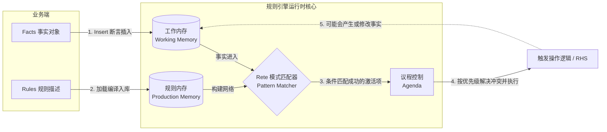
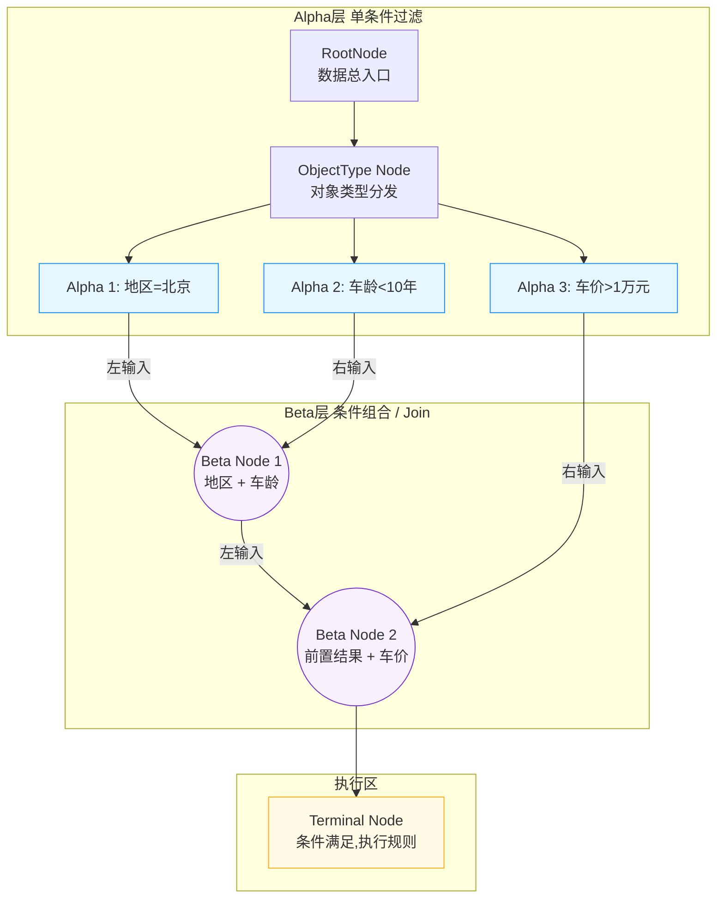

本文对 Rete 算法的执行架构、网络拓扑、编译与匹配过程进行说明，并附带 Python 代码模拟。

<!--more-->

## 1. 规则引擎执行架构（Match-Select-Act）

首先要理解 **事实 (Fact)** 与 **规则 (Rule)** 是如何交汇的。



执行分三个阶段：
- **匹配 (Match)**：Fact 插入工作内存，通过 Rete 网络与规则条件建立绑定。
- **选择 (Select)**：匹配成功的结果放入 Agenda，根据优先级决定执行顺序。
- **执行 (Act)**：触发动作，可能引起新的事实变更，从而触发新一轮匹配。

## 2. Rete 网络结构

当规则包含多个条件时，Rete 会构建多层网络，分为两部分：

- **Alpha Network**：对单个事实做属性过滤
- **Beta Network**：将多个 Alpha 节点的结果做 Join 连接



- **增量匹配**：Beta1 会缓存"地区+车龄"的组合结果。后续新增"车价"事实时，只需与 Beta1 的缓存做 Join，不必从头遍历。

## 3. 为什么要分 Alpha 和 Beta 两层

如果不做拆分，每来一条新事实就要把所有规则的所有条件重新算一遍，复杂度是 O(规则数 × 条件数)。

拆成两层后：

**Alpha 层做独立过滤**：每个条件单独检查一个属性，结果缓存在 Alpha 内存中。
- 新事实进来，只触发属性匹配的 Alpha 节点，其他节点不动
- 多条规则如果共用同一个条件（比如都要检查 `age < 10`），共享同一个 Alpha 节点，只算一次

**Beta 层做组合连接**：把多个 Alpha 的结果按 ID 做 Join，中间结果缓存在 Beta 内存中。
- 已经组合好的部分结果不需要重算。比如"地区+车龄"已经 Join 好了，后面"车价"事实到了，直接拿缓存做第二次 Join
- 多条规则如果前几个条件相同，共享同一条 Beta 路径，只在分歧点才分叉

类比数据库：Alpha 相当于 `WHERE` 过滤，Beta 相当于 `JOIN` 连接，Alpha/Beta 内存相当于缓存的中间结果。不分层就等于每次全表扫描加嵌套循环 Join；分层后相当于建了索引并缓存中间结果，只对增量部分做计算。

## 4. 编译与匹配推演

在 Rete 算法中，**事实 (Fact)** 用"三元组"表示：`(标识符 ^ 属性 值)`，简写为 `(FactID, Attribute, Value)`。

以车辆投保规则为例：

**事实集（进入工作内存）：**
*   `w1: (car1, area, "北京")`
*   `w2: (car1, age, 9)`
*   `w3: (car1, price, 15000)`

**规则条件（LHS / Pattern）：**
*   `c1`: 匹配地区 `(?, area, "北京")`
*   `c2`: 匹配车龄 `(?, age, <10)`
*   `c3`: 匹配车价 `(?, price, >10000)`

---

### 第一阶段：创建 Rete 网络（编译期）

引擎在事实产生前，读取规则库生成 Rete 网络：

1. **RootNode**：创建全局唯一的入口节点，所有事实从这里进入。
2. **Alpha 1**：取条件 `c1`，生成 `AlphaNode1` 检查 `attr == area && value == "北京"`，挂在 Root 下，附带 Alpha 内存。
3. **Alpha 2**：取条件 `c2`，生成 `AlphaNode2` 检查 `age < 10`，同样挂在 Root 下。
4. **Beta 1**：创建 `BetaNode1`，左输入接 `AlphaNode1`，右输入接 `AlphaNode2`。
5. **Alpha 3 + Beta 2**：取条件 `c3`，生成 `AlphaNode3` 检查 `price > 10000`；创建 `BetaNode2`，左输入接 `BetaNode1` 的输出，右输入接 `AlphaNode3`。
6. **Terminal**：将规则动作封装为 `TerminalNode`，接在 `BetaNode2` 之后。

---

### 第二阶段：匹配过程（运行时）

网络构建完成后，每条新事实进入网络，依次经过 Alpha 过滤（Select）和 Beta 连接（Join）：

1. **插入 `w1: (car1, area, "北京")`**
   - `w1` 从 RootNode 广播到所有 Alpha 节点。
   - `AlphaNode1` 匹配成功（`area == "北京"`），将 `w1` 存入 Alpha 内存，并通知下游 `BetaNode1`。
   - `AlphaNode2`、`AlphaNode3` 属性不匹配，丢弃。
2. **插入 `w2: (car1, age, 9)`**
   - `AlphaNode2` 匹配成功（`9 < 10`），存入内存，通知 `BetaNode1`。
   - **首次 Join**：`BetaNode1` 检查左侧（`AlphaNode1` 内存中有 `w1`）和右侧（`AlphaNode2` 内存中有 `w2`），两者 ID 均为 `car1`，Join 成功，生成组合 `(w1, w2)` 存入 Beta 内存，传递给 `BetaNode2`。
3. **插入 `w3: (car1, price, 15000)`**
   - `AlphaNode3` 匹配成功（`15000 > 10000`），存入内存，通知 `BetaNode2`。
   - **二次 Join**：`BetaNode2` 左侧已有来自 `BetaNode1` 的 `(w1, w2)`，右侧新到 `w3`，ID 一致，Join 成功，生成完整绑定集 `(w1, w2, w3)`。
4. **触发动作**
   - `(w1, w2, w3)` 到达 `TerminalNode`，所有条件满足，执行规则动作。

## 5. Python 代码模拟

下面将 **Root → Alpha → Beta(层1) → Beta(层2) → Terminal** 的网络用 Python 实现，观察数据逐层传递与 Join 组合的过程。

```python
from typing import Any, Callable, List, Tuple, Union

# ---- 数据结构 ----

class Fact:
    """三元组事实: (标识符, 属性, 值)"""
    def __init__(self, id: str, attr: str, value: Any) -> None:
        self.id: str = id
        self.attr: str = attr
        self.value: Any = value

    def __repr__(self) -> str:
        return f"({self.id}, {self.attr}, {self.value})"

# Token 是在网络中流转的绑定集，可以是单个 Fact 或 Fact 元组
Token = Union[Fact, Tuple[Fact, ...]]

def token_id(t: Token) -> str:
    """从 Token 中提取标识符，用于 Join 时的 ID 一致性校验"""
    return t.id if isinstance(t, Fact) else t[0].id

def token_to_tuple(t: Token) -> Tuple[Fact, ...]:
    return (t,) if isinstance(t, Fact) else t

# ---- 节点定义 ----

class ReteNode:
    def __init__(self, name: str) -> None:
        self.name: str = name
        self.children: List['ReteNode'] = []
        self.memory: List[Token] = []

    def pass_to_children(self, token: Token) -> None:
        print(f"  [放行] \033[92m{self.name}\033[0m")
        for child in self.children:
            child.receive(token)

    def receive(self, token: Token) -> None:
        pass

# Alpha 节点：单条件过滤
class AlphaNode(ReteNode):
    def __init__(self, name: str, attr: str, condition: Callable[[Any], bool]) -> None:
        super().__init__(name)
        self.attr: str = attr
        self.condition: Callable[[Any], bool] = condition

    def receive(self, token: Token) -> None:
        if isinstance(token, Fact) and token.attr == self.attr and self.condition(token.value):
            self.memory.append(token)
            self.pass_to_children(token)

# Beta 节点：Join 连接（按标识符做等值连接）
class BetaNode(ReteNode):
    def __init__(self, name: str, left_node: ReteNode, right_node: ReteNode) -> None:
        super().__init__(name)
        self.left: ReteNode = left_node
        self.right: ReteNode = right_node
        left_node.children.append(self)
        right_node.children.append(self)

    def receive(self, token: Token) -> None:
        """当左或右有新数据到达时，与对侧内存做 Join"""
        incoming_id = token_id(token)

        # 在左右两侧中寻找 ID 匹配的已有缓存
        left_matches = [m for m in self.left.memory if token_id(m) == incoming_id]
        right_matches = [m for m in self.right.memory if token_id(m) == incoming_id]

        if left_matches and right_matches:
            # 将左侧绑定集与右侧绑定集合并为更大的元组
            combined = token_to_tuple(left_matches[0]) + token_to_tuple(right_matches[0])
            self.memory.append(combined)
            self.pass_to_children(combined)

# 终端节点：触发规则动作
class TerminalNode(ReteNode):
    def __init__(self, name: str, action_func: Callable[[Tuple[Fact, ...]], None]) -> None:
        super().__init__(name)
        self.action = action_func

    def receive(self, token: Token) -> None:
        facts = token_to_tuple(token)
        print(f"\n=> 🎯 【规则激活】{self.name}")
        print(f"   匹配绑定集: {facts}")
        self.action(facts)

# ============ 构建 Rete 网络 ============

root = ReteNode("RootNode")

# [Layer 1] Alpha 节点
alpha_area = AlphaNode("Alpha[地区=北京]", 'area', lambda v: v == '北京')
alpha_age = AlphaNode("Alpha[车龄<10年]", 'age', lambda v: v < 10)
alpha_price = AlphaNode("Alpha[车价>1万]", 'price', lambda v: v > 10000)
root.children.extend([alpha_area, alpha_age, alpha_price])

# [Layer 2] Beta1: Join 地区 + 车龄
beta_1 = BetaNode("Beta1[地区+车龄]", alpha_area, alpha_age)

# [Layer 3] Beta2: Join Beta1 结果 + 车价
beta_2 = BetaNode("Beta2[合规+车价]", beta_1, alpha_price)

# Terminal: 执行动作
terminal = TerminalNode(
    "Terminal[推荐高价值投保套餐]",
    lambda facts: print(f"   ===> 执行动作：为 {facts[0].id} 推荐北京高价值投保套餐")
)
beta_2.children.append(terminal)

# ============ 运行测试 ============

print("1. 录入事实：地区...")
root.pass_to_children(Fact('car1', 'area', '北京'))
# Alpha[地区] 匹配，存入内存；Beta1 右侧为空，阻断

print("\n2. 录入事实：车龄...")
root.pass_to_children(Fact('car1', 'age', 9))
# Alpha[车龄] 匹配；Beta1 左右均有 car1 的数据，Join 成功 → 组合 (w1, w2)
# Beta2 右侧 alpha_price 为空，阻断

print("\n3. 录入事实：车价...")
root.pass_to_children(Fact('car1', 'price', 15000))
# Alpha[车价] 匹配；Beta2 左侧有 (w1,w2)，右侧有 w3，ID 一致 → Join 成功
# 完整绑定集 (w1, w2, w3) 到达 Terminal，触发动作
```

## 6. 优缺点

### 优点

1. **规则间共享节点**：不同规则如果有相同的条件模式，会共享 Alpha/Beta 节点。某个节点被 N 条规则共用，该节点上的匹配效率提升 N 倍。
2. **增量匹配**：Alpha 内存和 Beta 内存缓存了中间结果。事实集变化不大时，大部分节点状态不需要重算，只处理增量部分。
3. **匹配速度与规则数量无关**：事实在网络中传播时，不满足条件就被拦截，不会继续向下。规则再多，单条事实经过的路径长度是固定的。

### 缺点

1. **事实删除开销大**：删除事实时，除了要做和添加相同的计算外，还需要在内存中查找并清除相关的缓存记录。
2. **内存占用可能指数级增长**：Beta 内存存储的中间组合结果，会随着规则条件数和事实数量增长而膨胀。规则和事实很多时，可能耗尽内存。

### 实践建议

| 建议 | 原因 |
|------|------|
| 容易变化的规则放后面 | 减少规则变动导致的网络重建 |
| 约束性强的条件放前面 | 尽早过滤，减少进入 Beta 层的数据量 |
| 内存中只存指针，建索引 | 缓解 Beta 内存膨胀问题 |

一句话总结：Rete 用空间换时间——通过缓存中间结果加速匹配，代价是内存开销大。适合事实集相对稳定、规则频繁执行的场景。

## 相关链接

- RulEuler：基于 Rete 算法的开源规则引擎：[https://caritasem.github.io/2026/03/ruleuler-rule-engine-introduction/](https://caritasem.github.io/2026/03/ruleuler-rule-engine-introduction/)
- 开源规则引擎实践：[https://github.com/labulakalia/ibm_bak/blob/main/ibm_articles/%E5%BC%80%E6%BA%90%E8%A7%84%E5%88%99%E6%B5%81%E5%BC%95%E6%93%8E%E5%AE%9E%E8%B7%B5.md](https://github.com/labulakalia/ibm_bak/blob/main/ibm_articles/%E5%BC%80%E6%BA%90%E8%A7%84%E5%88%99%E6%B5%81%E5%BC%95%E6%93%8E%E5%AE%9E%E8%B7%B5.md)