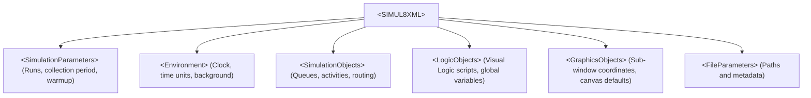
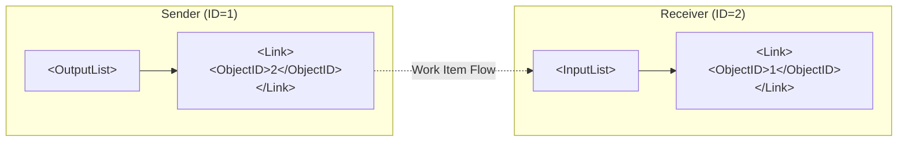

SIMUL8 is almost always used as a visual desktop tool. But under the hood, every `.S8` simulation file can be exported to and imported from an XML format. 

Compared to manual GUI drag-and-drop, XML provides a programmatic interface to automate model construction, parameter tuning, and batch scenario generation. To build models this way, the official schema file (`simul8_valid.xsd`) serves as the definitive specification for how SIMUL8 structures its objects, routing topology, probability distributions, and visual layout.

> **Schema Asset Download**: The schema file referenced in this post is available here: [`simul8_valid.xsd.gz`](/assets/posts/202608/simul8_valid.xsd.gz) (Gzip archive, 6.3 KB).

<!--more-->

---

## Why Care About the Schema?

SIMUL8 is closed-source. The XML schema is the only formal API contract available for external tools and scripts.

Writing SIMUL8 XML by hand or via templates without schema validation is error-prone:
- A typo in a tag name or an out-of-order element can cause SIMUL8 to crash on load or drop transactions silently.
- An orphaned node or broken link reference will stall entities indefinitely.
- Distribution parameters (`DistParam1` through `DistParam4`) change their meaning depending on the integer distribution type.

Validating generated XML against `simul8_valid.xsd` using standard tools (like Python's `lxml`) catches syntax errors and missing references in milliseconds, before the file ever touches the SIMUL8 GUI runtime.

---

## 1. Top-Level Structure: `<SIMUL8XML>`

Every SIMUL8 XML document starts with a `<SIMUL8XML>` root tag, which groups the model into six main sections:



In XSD definition, the root is a simple choice block:

```xml
<xs:element name="SIMUL8XML">
  <xs:complexType mixed="true">
    <xs:choice minOccurs="0" maxOccurs="unbounded">
      <xs:element ref="SimulationParameters"/>
      <xs:element ref="Environment"/>
      <xs:element ref="SimulationObjects"/>
      <xs:element ref="LogicObjects"/>
      <xs:element ref="GraphicsObjects"/>
      <xs:element ref="FileParameters"/>
    </xs:choice>
  </xs:complexType>
</xs:element>
```

### Global Configuration (`<SimulationParameters>`)
This block controls trial execution:
- `<Runs>` (under `<Trial>`): Number of replications for stochastic runs.
- `<ResultsCollectionPeriod>`: Total run time in clock units.
- `<Warmuptime>`: Initialization period excluded from result collection.
- `<Units>`: Distance and time measurement base units.

### Time & Operating Clock (`<Environment>`)
The `<Clock>` tag under `<Environment>` sets daily operating hours:
- `<Start_time>` and `<End_time>` define the active daily window (e.g., 8:00 to 18:30).
- `<Time_format>` and `<Unit_name>` specify whether numbers represent seconds, minutes, or hours.

---

## 2. Objects and Nodes: `<SimulationObject>`

All operational stations (entry points, queues, machines, exits, and resources) live inside `<SimulationObjects>` as individual `<SimulationObject>` elements.

### Required Attributes
Every object must declare three XML attributes:
1. `Name`: The display label shown in the UI.
2. `Type`: The entity type string recognized by SIMUL8.
3. `ID`: A unique positive integer used as the node's primary key for routing.

```xml
<SimulationObject Name="Queue_Support_Chat" Type="Storage Area" ID="2">
    <Index>2</Index>
    <Window>1</Window>
    <!-- object configuration -->
</SimulationObject>
```

### Core Entity Types

| SIMUL8 `Type` String | Role | Common Child Tags |
| :--- | :--- | :--- |
| **`Work Entry Point`** | Entity generator (Source) | `<InterArrivalTimeSampleData>`, `<batchsizeoutSampleData>` |
| **`Storage Area`** | Buffer / Queue | `<MaxConts>`, `<InitialConts>`, `<Expiretime>`, `<LIFO>` |
| **`Work Center`** | Processing station (Activity) | `<OperationTimeSampleData>`, `<ResourceList>`, `<BreakDowns>` |
| **`Work Complete`** | Exit point (Sink) | `<InputList>`, `<Collectresults>` |
| **`Resource`** | Staff / Equipment pool | `<PoolMembers>`, `<Relresources>`, `<Shifts>` |

---

## 3. Routing Topology: `<InputList>` and `<OutputList>`

SIMUL8 models the routing graph explicitly. Connections are stored as `<Link>` elements nested inside the sender's `<OutputList>` and the receiver's `<InputList>`.



### The `<Link>` Tag
A link specifies destination ID and routing weights:

```xml
<OutputList>
    <Link>
        <S8TheType>1000</S8TheType>
        <S8ObjectType>1</S8ObjectType>
        <ObjectID>2</ObjectID>
        <Percent>100</Percent>
        <Requnits>1</Requnits>
    </Link>
</OutputList>
```

- `<ObjectID>`: Target node `ID`.
- `<Percent>`: Routing percentage (when branching among multiple downstream nodes).
- `<Requnits>`: Batch size or resource count required for transfer.

### Two-Way Symmetry is Mandatory
SIMUL8 requires symmetric link definitions. If Node 1 points to Node 2 in its `<OutputList>`, Node 2 **must** list Node 1 in its `<InputList>`. If one side is missing, the simulation engine will fail to route items between the stations.

---

## 4. Probability Distributions: `*SampleData`

All stochastic variables—inter-arrival times, operation durations, changeover times—use a unified `<SampleData>` structure.

For work center processing times, SIMUL8 uses `<OperationTimeSampleData>`:

```xml
<OperationTimeSampleData>
    <DistribType>2</DistribType>
    <DistParam1>15.5</DistParam1>
    <DistParam2>0</DistParam2>
    <DistParam3>0</DistParam3>
    <DistParam4>0</DistParam4>
</OperationTimeSampleData>
```

### Distribution Type Encodings

`<DistribType>` is an integer enum that determines how `<DistParam1>` through `<DistParam4>` are interpreted:

| Value | Distribution | `DistParam1` | `DistParam2` | `DistParam3` |
| :---: | :--- | :--- | :--- | :--- |
| **`1`** | **Fixed / Constant** | Value ($c$) | `0` | `0` |
| **`2`** | **Exponential** | Mean ($\mu$) | `0` | `0` |
| **`3`** | **Normal** | Mean ($\mu$) | Standard Deviation ($\sigma$) | `0` |
| **`4`** | **Triangular** | Min ($a$) | Mode ($c$) | Max ($b$) |
| **`5`** | **Uniform** | Min ($a$) | Max ($b$) | `0` |
| **`6`** | **Erlang** | Mean ($\mu$) | Shape ($k$) | `0` |

---

## 5. Visual Layout: `<DisplayData>`

Even if you only care about simulation numbers, SIMUL8 requires `<DisplayData>` coordinates for every object. Without valid coordinates, all nodes will render stacked at coordinate `(0, 0)`.

```xml
<DisplayData>
    <Displaytype>4</Displaytype>
    <X1>440</X1>
    <Y1>280</Y1>
    <X2>490</X2>
    <Y2>329</Y2>
    <Xinc>-10</Xinc>
    <Yinc>0</Yinc>
    <TitleOffsetX>15</TitleOffsetX>
    <TitleOffsetY>-24</TitleOffsetY>
    <Invisible>No</Invisible>
</DisplayData>
```

- `X1, Y1, X2, Y2`: Bounding box pixels for the icon on the canvas.
- `TitleOffsetX, TitleOffsetY`: Relative label offset.
- When generating XML from scripts, calculating coordinates along a grid ($X_k = X_0 + k \cdot \Delta X$, $Y_i = Y_0 + i \cdot \Delta Y$) produces a clean, readable diagram when opened in SIMUL8.

---

## 6. Automating Schema Validation in Python

To verify generated XML files before loading them into SIMUL8, you can validate them against `simul8_valid.xsd` using `lxml`:

```python
from pathlib import Path
from lxml import etree

def validate_simul8_xml(xml_path: Path, xsd_path: Path) -> bool:
    schema_doc = etree.parse(str(xsd_path))
    schema = etree.XMLSchema(schema_doc)
    
    xml_doc = etree.parse(str(xml_path))
    try:
        schema.assertValid(xml_doc)
        print(f"[OK] {xml_path.name} is valid against SIMUL8 XSD.")
        return True
    except etree.DocumentInvalid as e:
        print(f"[ERROR] Schema validation failed for {xml_path.name}:")
        for error in e.error_log:
            print(f"  Line {error.line}: {error.message}")
        return False

if __name__ == "__main__":
    validate_simul8_xml(Path("model.xml"), Path("simul8_valid.xsd"))
```

### Common Traps
- **Custom Attributes**: SIMUL8 internal builds sometimes export non-standard attributes like `GUID="..."` on `<SimulationObject>`. If your schema is strict, strip non-standard attributes before validation.
- **Missing Link Symmetry**: Failing to add corresponding `<InputList>` entries for every `<OutputList>` entry won't necessarily violate the XSD syntax, but it will cause simulation logic to stall at runtime.

---

## 7. Summary

SIMUL8's XML format is structured and predictable once you understand its main building blocks:
1. `<SimulationParameters>` sets the global run parameters.
2. `<SimulationObject>` defines individual stations with required `Name`, `Type`, and `ID`.
3. `<InputList>` and `<OutputList>` store the directed graph topology.
4. `*SampleData` parameterizes random variables via integer type enums.
5. `<DisplayData>` positions elements cleanly on the 2D visual canvas.

With `simul8_valid.xsd` as a contract and `lxml` as a validator, you can build reliable scripts to generate, parameterize, and test SIMUL8 models programmatically.
